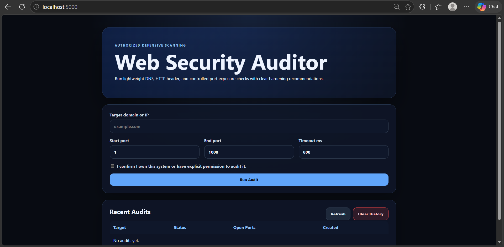
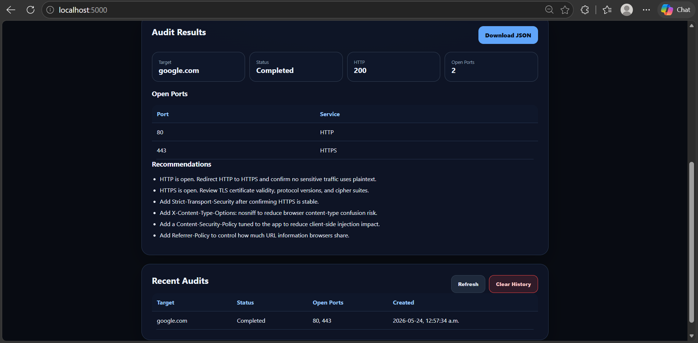
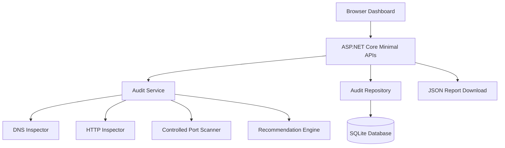

<div align="center">

# 🛡️ Web Security Auditor

### Production-ready defensive web security auditing platform for authorized DNS, HTTP header, and controlled port exposure checks.

<p>
  
  
  
</p>

<p>
  
  
  
</p>

<p>
  <a href="#-overview">Overview</a> •
  <a href="#-features">Features</a> •
  <a href="#-screenshots">Screenshots</a> •
  <a href="#-architecture">Architecture</a> •
  <a href="#-quick-start">Quick Start</a> •
  <a href="#-api-reference">API</a> •
  <a href="#-troubleshooting">Troubleshooting</a>
</p>

</div>

---

## 📌 Overview

**Web Security Auditor** is a defensive security auditing platform that inspects a target’s externally visible web posture through DNS resolution, HTTP/HTTPS inspection, controlled port scanning, and actionable hardening recommendations.

It was rebuilt from a legacy web-server inspection tool into a clean **portfolio-grade .NET 8 application** with API endpoints, SQLite persistence, Docker support, CI/CD, tests, and a browser dashboard.

> ⚠️ Use this tool only on systems you own or are explicitly authorized to assess.

---

## ✨ Features

<table>
<tr>
<td width="33%" valign="top">

### 🔍 Security Checks

- DNS resolution
- HTTP/HTTPS status checks
- Header inspection
- Controlled TCP port scan
- Open service summary
- Security recommendations

</td>
<td width="33%" valign="top">

### 🧩 Platform

- ASP.NET Core API
- Browser dashboard
- SQLite audit history
- JSON report download
- Clear History control
- Local-first persistence

</td>
<td width="33%" valign="top">

### 🚀 Engineering

- .NET 8 solution structure
- Docker support
- GitHub Actions CI
- xUnit tests
- Clean service separation
- Troubleshooting docs

</td>
</tr>
</table>

---

## 🧱 Tech Stack

<div align="center">

<table>
<tr>
<td align="center" width="25%">
<br/>
<b>.NET 8</b><br/>
Backend
</td>

<td align="center" width="25%">
<br/>
<b>ASP.NET Core</b><br/>
API
</td>

<td align="center" width="25%">
<br/>
<b>SQLite</b><br/>
Database
</td>

<td align="center" width="25%">
<br/>
<b>HTML/CSS/JS</b><br/>
Frontend
</td>
</tr>

<tr>
<td align="center">
<br/>
<b>xUnit</b><br/>
Testing
</td>

<td align="center">
<br/>
<b>Git</b><br/>
DevOps
</td>

<td align="center">
<br/>
<b>GitHub Actions</b><br/>
CI/CD
</td>

<td align="center">
<br/>
<b>Docker</b><br/>
Containerization
</td>
</tr>

</table>

</div>

---

## 📸 Screenshots

<p align="center">
  
  
</p>

---

## 🏗️ Architecture

<div align="center">



</div>

### System Flow

| Step |                       What Happens                      |
|------|---------------------------------------------------------|
|  1   | User enters a domain/IP and confirms authorization      |
|  2   | API validates target, port range, and timeout           |
|  3   | DNS, HTTP, and controlled TCP checks run asynchronously |
|  4   | Recommendation engine generates hardening guidance      |
|  5   | Report is saved to SQLite and displayed in dashboard    |
|  6   | User can download JSON or clear local audit history     |

---

## 📁 Folder Structure

```text
web-security-auditor/
├── src/
│   ├── WebSecurityAuditor.Api/       # API, dashboard, persistence
│   └── WebSecurityAuditor.Core/      # domain and auditing logic
├── tests/
│   └── WebSecurityAuditor.Tests/     # unit tests
├── docs/
│   └── ARCHITECTURE.md
├── Dockerfile
├── docker-compose.yml
├── WebSecurityAuditor.sln
└── README.md
```

---

## ⚡ Quick Start

### Prerequisites

| Requirement |       Version      |
|-------------|--------------------|
|  .NET SDK   |        8.0+        |
|   Docker    |      Optional      |
|     Git     | Any recent version |

### Run Locally

```bash
dotnet restore WebSecurityAuditor.sln
dotnet build WebSecurityAuditor.sln
dotnet run --project src/WebSecurityAuditor.Api/WebSecurityAuditor.Api.csproj
```

Open:

```text
http://localhost:5000
```

### Run Tests

```bash
dotnet test WebSecurityAuditor.sln
```

### Run with Docker

```bash
docker compose up --build
```

Open:

```text
http://localhost:8080
```

---

## 🔌 API Reference

### Create Audit

```bash
curl -X POST http://localhost:5000/api/audits \
  -H "Content-Type: application/json" \
  -d '{"target":"example.com","startPort":80,"endPort":443,"timeoutMs":800,"authorized":true}'
```

### List Audits

```bash
curl http://localhost:5000/api/audits
```

### Read Audit by ID

```bash
curl http://localhost:5000/api/audits/{id}
```

### Download JSON Report

```bash
curl -OJ http://localhost:5000/api/reports/{id}/download
```

### Clear Audit History

```bash
curl -X DELETE http://localhost:5000/api/audits
```

---

## 🛡️ Defensive Guardrails

<table>
<tr>
<td width="50%" valign="top">

### ✅ Included

- Authorization acknowledgement
- 1000-port safety limit
- Controlled timeout handling
- Local audit persistence
- Clear History option
- Defensive recommendations

</td>
<td width="50%" valign="top">

### ❌ Not Included

- Exploit execution
- Credential attacks
- Payload injection
- Authentication bypass
- Privilege escalation
- Intrusive enumeration

</td>
</tr>
</table>

---

## 🧪 What This Project Demonstrates

|       Skill Area       |                 Demonstrated Through               |
|------------------------|----------------------------------------------------|
| Backend Engineering    | ASP.NET Core APIs, clean services, validation      |
| Security Engineering   | Defensive scanning, guardrails, recommendations    |
| Data Persistence       | SQLite + EF Core audit history                     |
| Full-Stack Integration | Dashboard connected to REST APIs                   |
| DevOps                 | Docker and GitHub Actions                          |
| Testing                | xUnit validation and recommendation tests          |
| Production Thinking    | Troubleshooting docs, safety limits, clear history |

---

## 🧰 Troubleshooting

<details>
<summary><strong>IHttpClientFactory could not be found</strong></summary>

Make sure `src/WebSecurityAuditor.Core/WebSecurityAuditor.Core.csproj` includes:

```xml
<PackageReference Include="Microsoft.Extensions.Http" Version="8.0.1" />
```

Then run:

```bash
dotnet clean
dotnet restore WebSecurityAuditor.sln
dotnet build WebSecurityAuditor.sln
```

</details>

<details>
<summary><strong>CS0168: The variable 'ex' is declared but never used</strong></summary>

This project treats warnings as errors:

```xml
<TreatWarningsAsErrors>true</TreatWarningsAsErrors>
```

Use this pattern if the exception object is not needed:

```csharp
catch (HttpRequestException) when (scheme == "https")
{
    continue;
}
```

</details>

<details>
<summary><strong>FactAttribute could not be found</strong></summary>

Each test file should include:

```csharp
using Xunit;
```

The test project should include:

```xml
<PackageReference Include="Microsoft.NET.Test.Sdk" Version="17.11.1" />
<PackageReference Include="xunit" Version="2.9.2" />
<PackageReference Include="xunit.runner.visualstudio" Version="2.8.2" />
```

Then run:

```bash
dotnet clean
dotnet restore WebSecurityAuditor.sln
dotnet build WebSecurityAuditor.sln
dotnet test WebSecurityAuditor.sln
```

</details>

<details>
<summary><strong>dotnet run appears stuck after Now listening on localhost</strong></summary>

That is expected. The API server is running and waiting for browser/API requests.

Open:

```text
http://localhost:5000
```

To stop the server:

```text
Ctrl + C
```

</details>

<details>
<summary><strong>Port range safety error</strong></summary>

The scanner intentionally limits scans to 1000 ports.

Use a smaller range, for example:

```text
Start Port = 80
End Port = 443
```

</details>

<details>
<summary><strong>Recent audits remain after restart</strong></summary>

This is expected because the app uses SQLite persistence.

To remove audit history:

- Click **Clear History** in the dashboard
- Or manually delete local database files:

```text
audits.db
audits.db-shm
audits.db-wal
```

</details>

---

## 🔄 Recommended Clean Rebuild

```bash
dotnet clean
dotnet restore WebSecurityAuditor.sln
dotnet build WebSecurityAuditor.sln
dotnet test WebSecurityAuditor.sln
dotnet run --project src/WebSecurityAuditor.Api/WebSecurityAuditor.Api.csproj
```

---

## 🗺️ Roadmap

| Priority |                  Improvement                   |
|----------|------------------------------------------------|
|   High   | Authentication and user-specific audit history |
|   High   | TLS certificate expiry checks                  |
|  Medium  | OWASP security header scoring                  |
|  Medium  | API key authentication and rate limiting       |
|  Medium  | Background audits with progress updates        |
|   Low    | Kubernetes deployment manifests                |
|   Low    | Cloud deployment templates                     |
|   Low    | Observability dashboards                       |

---

## 📄 License

MIT License

---

## ⚠️ Disclaimer

This project is intended strictly for defensive and educational purposes.

Only use this tool on systems you own or are explicitly authorized to assess.
